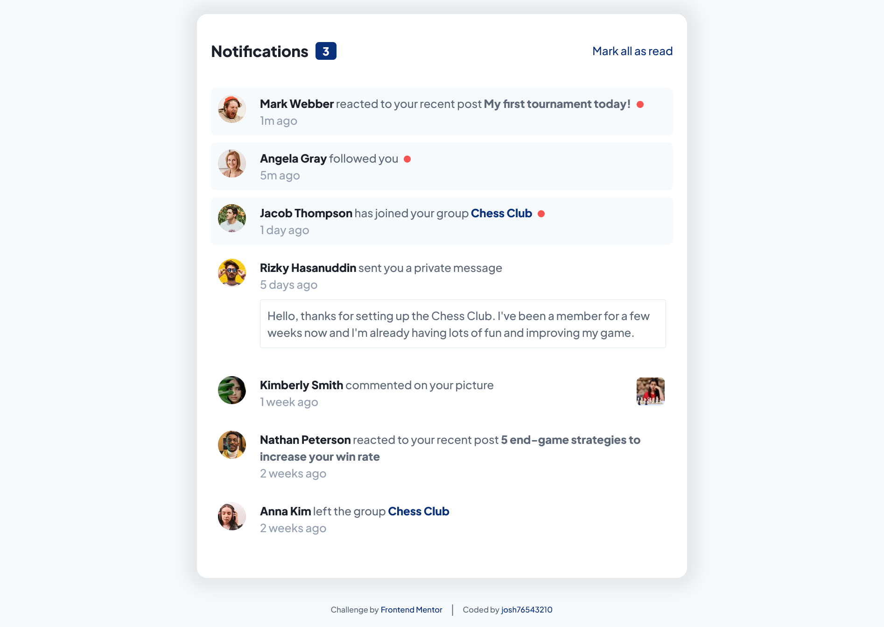

# Frontend Mentor - Notifications page solution

This is a solution to the [Notifications page challenge on Frontend Mentor](https://www.frontendmentor.io/challenges/notifications-page-DqK5QAmKbC). Frontend Mentor challenges help you improve your coding skills by building realistic projects.

## Table of contents

- [Overview](#overview)
  - [The challenge](#the-challenge)
  - [Screenshot](#screenshot)
  - [Links](#links)
- [My process](#my-process)
  - [Built with](#built-with)
  - [What I learned](#what-i-learned)
- [Author](#author)

## Overview

### The challenge

Users should be able to:

- Distinguish between "unread" and "read" notifications
- Select "Mark all as read" to toggle the visual state of the unread notifications and set the number of unread messages to zero
- View the optimal layout for the interface depending on their device's screen size
- See hover and focus states for all interactive elements on the page

### Screenshot



### Links

- Solution URL: [Add solution URL here]()
- Live Site URL: [Add live site URL here]()

## My process

### Built with

- HTML
- CSS
- JavaScript

### What I learned

Using JavaScript and CSS to toggle notification elements.

```css
/* unread notification */
.notification.unread {
  background-color: var(--very-light-grayish-blue);
}

.notification.unread .red-dot {
  height: calc((10 / 16) * 1rem);
  width: calc((10 / 16) * 1rem);
  border-radius: 50%;
  background-color: var(--red);
  margin-left: calc((5 / 16) * 1rem);

  display: inline-block;
}
```

```js
// toggle notification
function toggleNotification(e) {
  // if clicked item is not a link
  if (e.target.tagName !== "A") {
    this.classList.toggle("unread");
    updateTopBar();
  }
}
```

## Author

- Frontend Mentor - [@josh76543210](https://www.frontendmentor.io/profile/josh76543210)
- Twitter - [@josh76543210](https://www.twitter.com/josh76543210)
